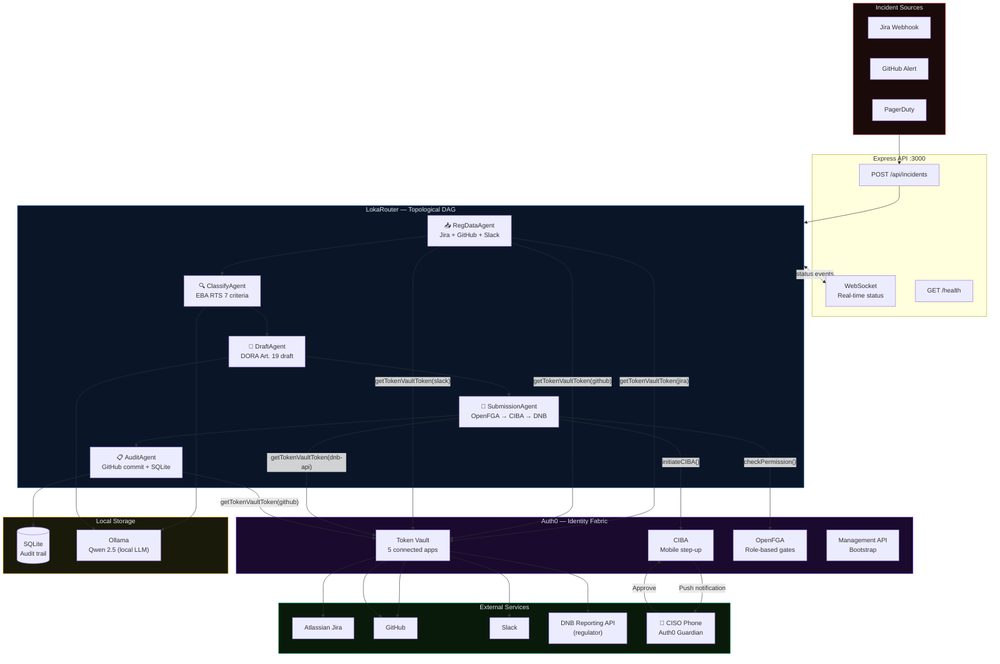
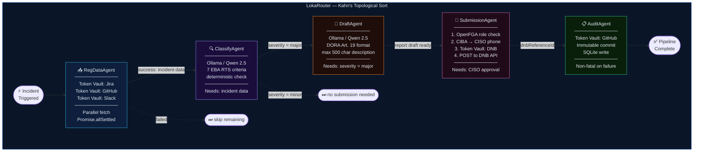
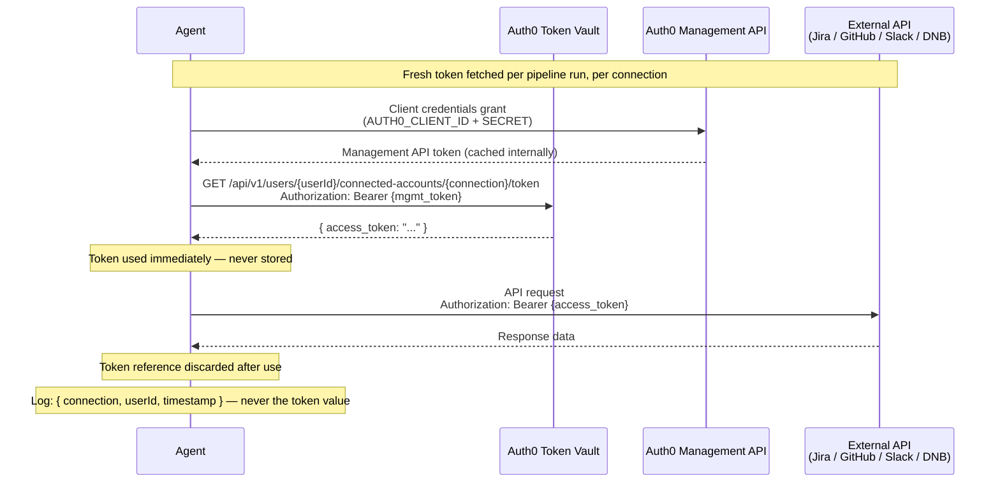
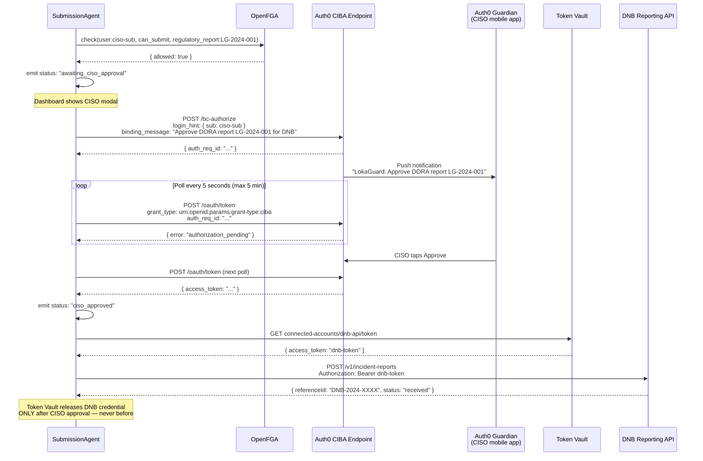
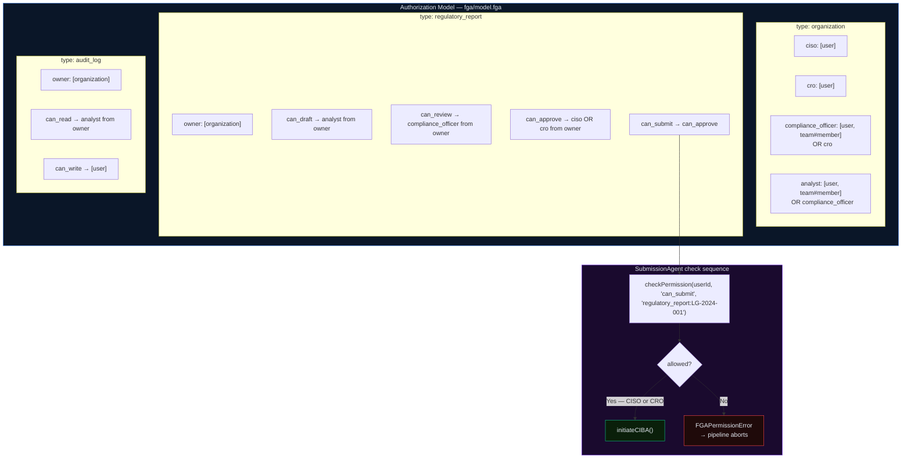
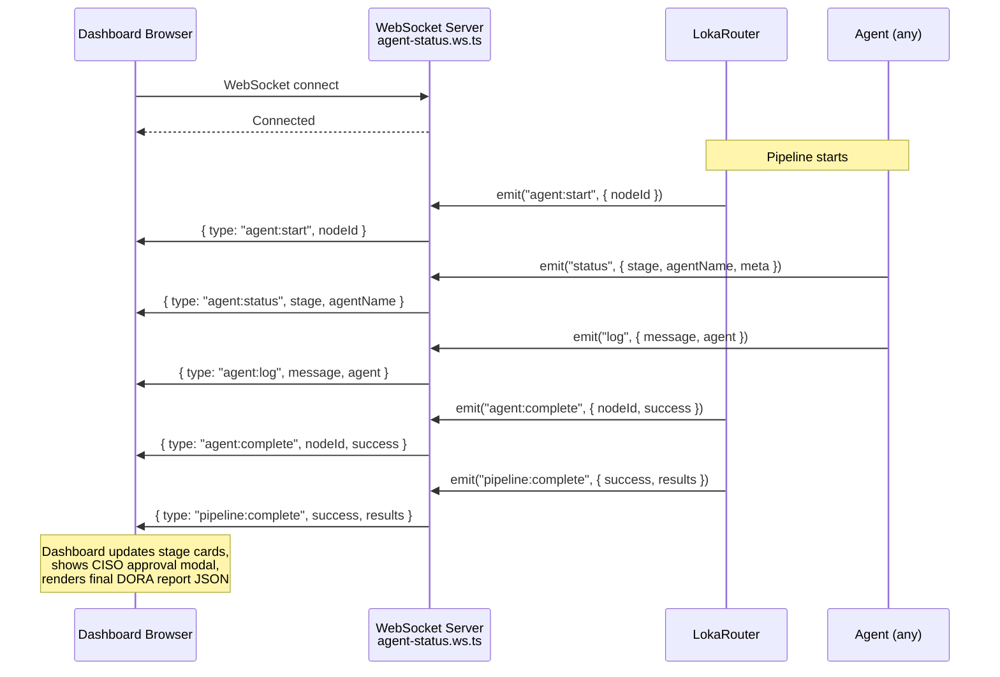
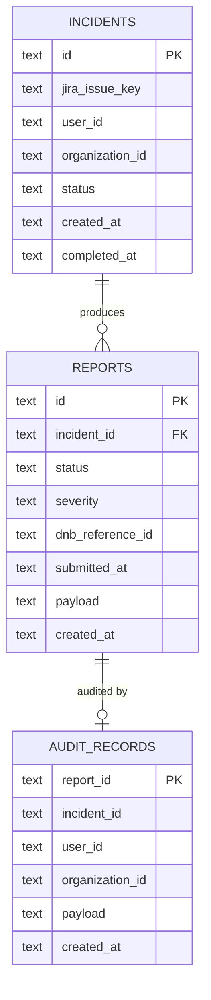
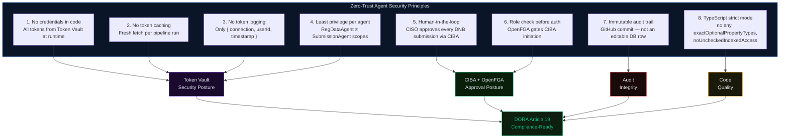

# LokaGuard Auth — Architecture

> DORA Article 19 automated ICT incident reporting pipeline.
> Identity layer: Auth0 Token Vault · CIBA · OpenFGA

---

## 1. System Overview



---

## 2. Agent DAG — Dependency Graph



---

## 3. Auth0 Token Vault Flow

Every external API call follows this pattern. **No token is ever stored, cached, or logged.**



**Connected apps configured in Auth0 Dashboard → Token Vault:**

| Connection | Service | Used by Agent | Scopes |
|---|---|---|---|
| `jira` | Atlassian Jira | RegDataAgent | `read:jira-work` |
| `github` | GitHub | RegDataAgent, AuditAgent | `repo`, `contents:write` |
| `slack` | Slack | RegDataAgent | `channels:history` |
| `dnb-api` | DNB Reporting API | SubmissionAgent | `submit:incident-report` |
| `azure-devops` | Azure DevOps | RegDataAgent | `vso.work_read` |

---

## 4. CIBA Step-Up Authentication Flow

CIBA is triggered **only in SubmissionAgent**, and **only after** OpenFGA confirms the user is CISO or CRO.



---

## 5. OpenFGA Authorization Model



**Role hierarchy (highest to lowest):**

```
CISO ──────────────────────────────────────── can_submit, can_approve, can_review, can_draft
CRO ────────────────────────────────────────  can_submit, can_approve, can_review, can_draft
compliance_officer ─────────────────────────  can_review, can_draft
analyst ────────────────────────────────────  can_draft
```

---

## 6. WebSocket Real-Time Status



---

## 7. Database Schema



---

## 8. Security Model



---

## 9. Project File Structure

```
lokaguard-auth/
│
├── src/
│   ├── index.ts                      Express + WebSocket server entry
│   ├── config.ts                     Zod env validation (crash-fast)
│   │
│   ├── agents/
│   │   ├── base.agent.ts             Abstract BaseAgent (EventEmitter)
│   │   ├── loka-router.ts            DAG orchestrator (Kahn's topo sort)
│   │   ├── reg-data.agent.ts         Jira + GitHub + Slack via Token Vault
│   │   ├── classify.agent.ts         DORA severity (Qwen 2.5 + EBA RTS)
│   │   ├── draft.agent.ts            DORA Art. 19 draft (Qwen 2.5)
│   │   ├── submission.agent.ts       OpenFGA → CIBA → Token Vault → DNB
│   │   └── audit.agent.ts            GitHub commit + SQLite via Token Vault
│   │
│   ├── auth/
│   │   ├── token-vault.ts            Token Vault client (5 connections)
│   │   ├── management.ts             Auth0 Management API (bootstrap only)
│   │   ├── ciba.ts                   CIBA initiate + poll loop (5 min timeout)
│   │   └── openfga.ts                check() + batchCheck()
│   │
│   ├── llm/
│   │   ├── qwen.client.ts            Ollama HTTP client
│   │   └── prompts/
│   │       ├── classify.prompt.ts    EBA RTS extraction prompt
│   │       └── draft-report.prompt.ts DORA notification generation
│   │
│   ├── regulatory/
│   │   ├── dora-classifier.ts        7-criterion deterministic classifier
│   │   ├── report-builder.ts         DORAInitialNotification assembler
│   │   └── dnb-client.ts             DNB API client (submit + status)
│   │
│   ├── api/
│   │   ├── routes/
│   │   │   ├── incidents.ts          POST /api/incidents
│   │   │   ├── reports.ts            GET /api/reports/:id
│   │   │   └── health.ts             GET /health
│   │   ├── middleware/
│   │   │   ├── auth.middleware.ts    JWT via Auth0 JWKS
│   │   │   └── logger.middleware.ts  Winston structured JSON
│   │   └── ws/
│   │       └── agent-status.ws.ts   WebSocket → dashboard broadcast
│   │
│   ├── db/
│   │   └── sqlite.ts                 better-sqlite3 (WAL mode, 3 tables)
│   │
│   └── types/
│       ├── incident.types.ts
│       ├── report.types.ts           DORAInitialNotification interface
│       └── agent.types.ts            AgentContext, AgentResult, AgentTrace
│
├── tests/
│   ├── agents/
│   │   ├── loka-router.test.ts       DAG sort, circular dep detection
│   │   └── submission.agent.test.ts  CIBA flow, status events, FGA errors
│   ├── auth/
│   │   ├── token-vault.test.ts       Demo tokens, 401 handling
│   │   └── ciba.test.ts              Approve, denied, timeout flows
│   └── regulatory/
│       └── dora-classifier.test.ts   All 7 EBA RTS criteria
│
├── fga/
│   └── model.fga                     OpenFGA authorization model
│
├── public/
│   └── dashboard/
│       └── index.html                Real-time WebSocket dashboard
│
├── scripts/
│   └── dnb-mock/
│       └── server.js                 Mock DNB Reporting API (docker)
│
├── .github/
│   └── workflows/
│       └── ci.yml                    GitHub Actions: typecheck + test + build
│
├── docker-compose.yml                Full stack (app + Ollama + DNB mock + OpenFGA)
├── Dockerfile                        Multi-stage Node 20 build
├── .env.example                      All required vars documented
├── ARCHITECTURE.md                   This file — system diagrams
├── DEPLOY.md                         Deployment guide
├── CONTRIBUTING.md                   Development setup
├── LICENSE                           Apache 2.0
└── README.md                         Judges start here
```

---

## 10. Technology Decisions

| Decision | Choice | Rationale |
|---|---|---|
| Agent orchestration | Custom DAG (Kahn's algorithm) | Explicit dependency declaration, no hidden ordering, circular dep detection at startup |
| LLM runtime | Ollama + Qwen 2.5 (local) | Incident data stays on-network; DORA data residency requirements satisfied by design |
| Authorization | OpenFGA | Fine-grained role model with composable relations; batchCheck avoids N+1 calls |
| Step-up auth | CIBA (backchannel) | Server-side agent pipeline cannot use redirect flows; CIBA is the correct OAuth 2.0 pattern |
| Credential management | Auth0 Token Vault | Fresh scoped tokens per agent per run; zero credential persistence |
| Audit trail | GitHub commit | Immutable by design; timestamped; reviewable by regulators without special tooling |
| Type system | TypeScript 5 strict | `exactOptionalPropertyTypes` + `noUncheckedIndexedAccess` catch latent bugs before runtime |
| Testing | Vitest with module mocks | Fast; ESM-native; `vi.mock` at module boundary keeps agents testable without real Auth0 |
